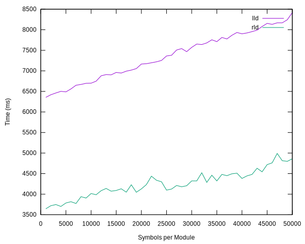

# timey

A utility for timing linkers.

## Usage

1.  Install [Node.js](https://nodejs.org/):

    -   macOS (Using [HomeBrew](https://brew.sh/))

        ~~~bash
        brew install node
        ~~~

    -   Linux

        ~~~bash
        sudo apt-get install nodejs
        ~~~

2.  Install the various modules on which the tools depend:

    ~~~bash
    npm install
    ~~~

3.  Modify the `./update` script, setting the following variables:

    -   `BIN_DIR`: The locations of the executables to be timed. Normally set this inside your LLVM build directory.
    -   `WORK_DIR`: The directory to be used for the working files. This directory should exist but be empty.
    -   `EXTERNAL`: The maximum number of external symbols to be created.
    -   `LINKONCE`: The maximum number of link-once symbols to be created.
    -   `INCREMENT`: The first test generates output files with 0 external and 0 linkonce; each subsequent test increments these values by `INCREMENT` until they reach the `EXTERNAL` and `LINKONCE` setting respectively.
    -   `MODULES`: The number of modules (simulated compilations) that are created for each test.

    The total number of symbols created for each point of the performance profile graphs is (x \* MODULES) \* (y \* MODULES) where x is a value in the interval \[0, LINKONCE\] and y is a value in the interval \[0, EXTERNAL\]. The INCREMENT value determines the number of samples taken across each axis.

4.  Run the update script:

    ~~~bash
    ./update
    ~~~

5.  Wait patiently. Generating and linking test data for hundreds or even thousands of binaries can take a very long time!

6.  Results (both SVG graphs and the raw CSV data) are available in the results directory.

## Performance Profiles

### lld

[Raw data](./results/lld.csv)

This chart shows the link times for lld for different numbers of external and linkonce symbols.

### rld

[Raw data](./results/rld.csv)

This chart shows the link times for rld for different numbers of external and linkonce symbols.

## Comparisons (lld vs. rld)

### External symbol resolution

[Raw data](./results/compare_external.csv)

This chart shows the performance of the two linkers when presented with modules containing a (fixed) large number of linkonce symbols and variable number of external symbols.

### Linkonce symbol resolution

[Raw data](./results/compare_linkonce.csv)

This chart shows the performance of the two linkers when presented with modules containing a (fixed) large number of external symbols and variable number of linkonce symbols.
