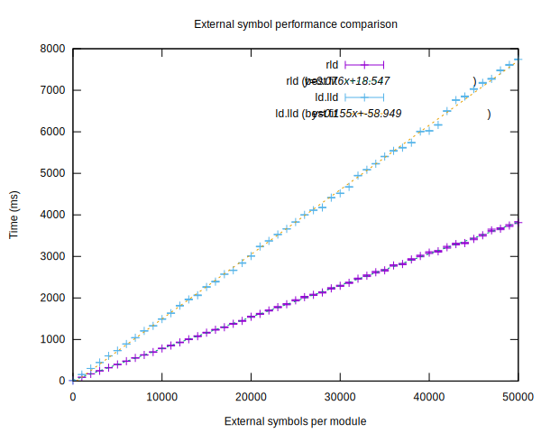
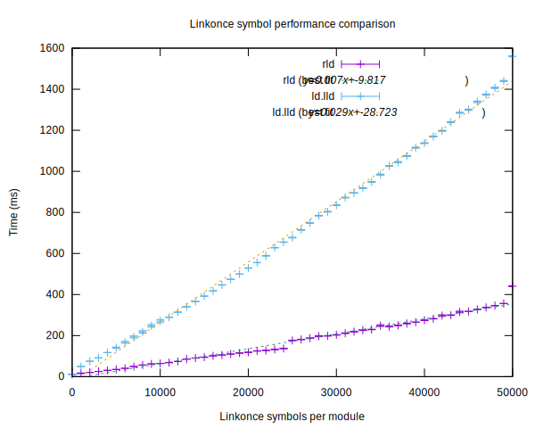
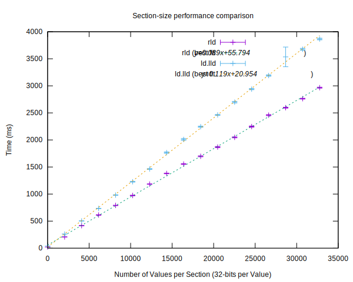
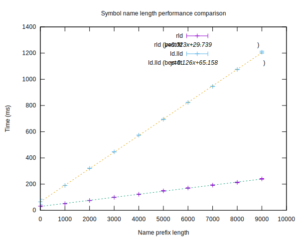

# Timing Results

## Repositories

| Repository | Commit |
| --- | --- |
| [llvm-project-prepo](http://github.com/SNSystems/llvm-project-prepo) | commit [`{{llvm_project_prepo_short}}`](https://github.com/SNSystems/llvm-project-prepo/commit/{{llvm_project_prepo_long}}) |
| [pstore](http://github.com/SNSystems/pstore) | commit [`{{pstore_short}}`](https://github.com/SNSystems/pstore/commit/{{pstore_long}}) |

## Host

The host machine used for these timings: {{host}}

## Comparisons (lld vs. rld)

The following charts show the results of running the two linker with varying, amounts of gest input. These inputs are created by the rld-gen tool (for linkers other than rld, repo2obj is then used to convert this data and produce object files for the test).

They are not intended in any way to mimic “real world” usage but are instead more akin to compiler benchmarks in that each test is intended to exercise and measure isolated features of the tool.

Each data point of each chart shows the result of performing {{runs}} links. The center point of the line shows the mean time for of all of the runs. The error bars show the 95% confidence interval. The “best fit” line is computed from the least squares of the mean values.

### Test Parameter Notation

Tests all follow the same pattern: we run rld-gen, followed by the requested linker(s). Before running a linker other than rld, we convert the rld-gen output to object files using repo2obj.

The test parameters follow an expanded version of the rld-gen command-line syntax. The number of each type of objects to be generated is listed. To generate the range of inputs required for these tests one or more of these arguments can include a range of values. These are specified as min,max,step (in a similar fashion to [Fortran do loops](https://fortran-lang.org/learn/quickstart/operators_control_flow#loop-constructs-do)). 

For example, consider a test parameter such as:

`--modules 10 --common 0 --linkonce 0 --external 0,1000,100`

This will produce 11 data points with the ‘external’ value sweeping from 0 to 1000 in steps of 100.

### Results

#### External Symbol Resolution

This chart shows the performance of the two linkers when presented with {{modules}} modules containing a variable number of external symbols.

Test parameters: `{{external_tp}}` 
Raw data: [rld](./external.rld.csv) [ld.lld](./external.ld.lld.csv)

#### Linkonce Symbol Resolution

This chart shows the performance of the two linkers when presented with {{modules}} modules containing a variable number of linkonce symbols.

Test parameters: `{{linkonce_tp}}` 
Raw data: [rld](./linkonce.rld.csv) [ld.lld](./linkonce.ld.lld.csv)

#### Common Symbol Resolution

This chart shows the performance of the two linkers when presented with {{modules}} modules containing a variable number of common symbols.

Test parameters: `{{common_tp}}` 
Raw data: [rld](./common.rld.csv) [ld.lld](./common.ld.lld.csv)

#### Per-module Overhead

This chart shows the per-module overhead for each linker. For each data point, the number of input modules is increased but those modules are all empty.

Test parameters: `{{module_tp}}` 
Raw data: [rld](./modules.rld.csv) [ld.lld](./modules.ld.lld.csv)

#### Section size

This chart shows the effect of changing the amount of data carried in each section. A test of raw copying performance.

Test parameters: `{{section_size_tp}}` 
Raw data: [rld](./section-size.rld.csv) [ld.lld](./section-size.ld.lld.csv)

#### Name Length

This chart shows how link time is effected by the length of the strings being processed by the linker. For these runs, the contents of the input files is constant: only the length of the definition names is being changed.

Test parameters: `{{prefix_length_tp}}` 
Raw data: [rld](./prefix-length.rld.csv) [ld.lld](./prefix-length.ld.lld.csv)
